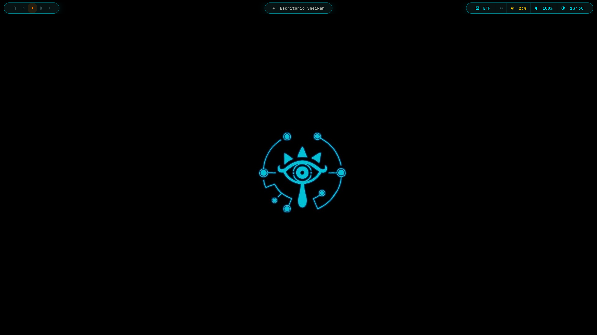
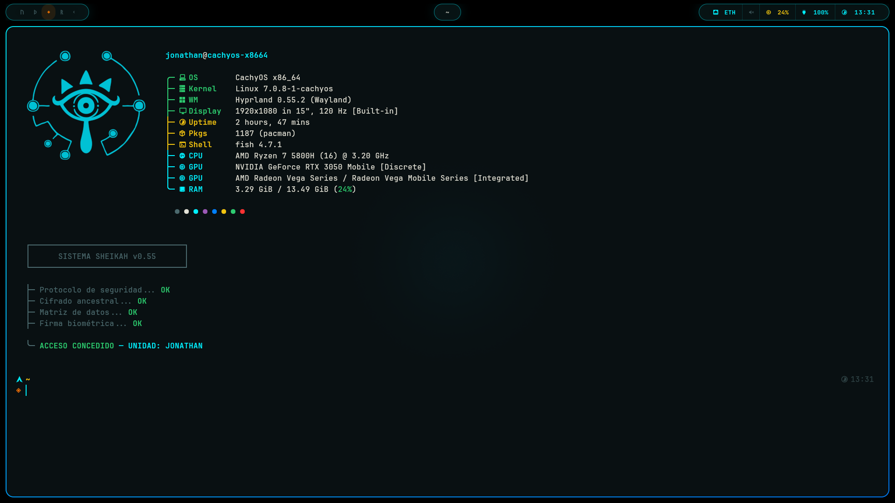

<h1 align="center">📱 Sheikah Slate OS</h1>

<p align="center">
  <b>Hyprland dotfiles inspired by the Sheikah Slate from <i>The Legend of Zelda: Breath of the Wild</i>.</b><br>
  A cyan-on-black desktop built from scratch on CachyOS: animated borders, a rune-based status bar and a lock screen that asks for your "access key".
</p>

<p align="center">
  
  
  
  <a href="LICENSE"></a>
</p>

<p align="center">
  
</p>

<p align="center">
  
</p>

---

## ✨ Highlights

- **Hyprland in Lua** (`hyprland.lua`): custom bezier and spring curves for opening, closing and moving windows, plus a **rotating cyan gradient** on the active border.
- **Waybar HUD**: floating "pills" with **Sheikah runes as workspaces** (`ᚢ ᚦ ᚨ ᚱ ᚲ`), app-aware window titles, network, volume, RAM, battery and clock.
- **Hyprlock "Sheikah System"**: blurred screenshot background, big glowing clock and an access-denied counter.
- **Hypridle in three phases**: dim at 4 min → lock at 5 min → screen off at 8 min.
- **Kitty palette mapped to Zelda lore**: cyan for Sheikah energy, orange for selection, yellow for the Triforce.
- **Fish greeting**: Fastfetch with the Sheikah eye, followed by an animated "authentication sequence".
- **Starship prompt**, **Rofi** launcher, **Dunst** notifications styled by urgency, and **screenshots with screen freeze** (Grimblast + Satty for annotations).

## 🗂️ What's inside

| Path | What it configures |
|---|---|
| `.config/hypr/` | Hyprland (`hyprland.lua`), Hyprlock, Hypridle, Hyprpaper and wallpapers |
| `.config/waybar/` | Status bar modules (`config.jsonc`) and style (`style.css`) |
| `.config/kitty/` | Terminal: font, colours, tabs and shortcuts |
| `.config/fish/` | Shell startup: Starship, Fastfetch and the Sheikah greeting |
| `.config/starship.toml` | Prompt |
| `.config/fastfetch/` | System info with the Sheikah logo |
| `.config/rofi/` | Launcher theme (`sheikah.rasi`) |
| `.config/dunst/` | Notifications |
| `.config/gtk-3.0/`, `.config/gtk-4.0/`, `.config/nwg-look/` | GTK theme, icons, cursor and font |
| `.config/micro/` | Micro editor with Catppuccin colour schemes |
| `.config/assets/` | Fastfetch logo and README screenshots |

## 📦 Dependencies

Tested on **CachyOS** with **Hyprland 0.55.2**. Package names are for Arch/CachyOS and may change over time.

```bash
# Official repositories
sudo pacman -S --needed hyprland hyprlock hypridle waybar kitty rofi dunst \
  fish starship fastfetch nwg-look xsettingsd gnome-keyring \
  brightnessctl wireplumber pavucontrol thunar cava satty micro \
  papirus-icon-theme ttf-jetbrains-mono-nerd

# AUR
yay -S --needed grimblast-git networkmanager-dmenu-git bibata-cursor-theme-bin
```

You also need:

- **`awww`** (the wallpaper daemon formerly known as `swww`), started from `hyprland.lua`.
- A **Catppuccin Mocha Teal** GTK theme, applied with `nwg-look`.
- **Optional** apps bound to shortcuts: Firefox, VS Code and Spotify.

## 🚀 Installation

> [!WARNING]
> This overwrites your current configuration in `~/.config`. Back it up first (step 2).

Run these commands in **bash**:

```bash
# 1. Clone the repository
git clone https://github.com/JonaRu32/sheikah-slate-os.git ~/sheikah-slate-os

# 2. Back up the configs that will be replaced
mkdir -p ~/.config-backup
for d in hypr waybar kitty fish fastfetch rofi dunst gtk-3.0 gtk-4.0 nwg-look micro starship.toml; do
  [ -e ~/.config/$d ] && cp -r ~/.config/$d ~/.config-backup/
done

# 3. Copy the dotfiles
cp -r ~/sheikah-slate-os/.config/. ~/.config/

# 4. Replace my home path with yours
sed -i "s|/home/jonathan|$HOME|g" \
  ~/.config/hypr/hyprland.lua ~/.config/hypr/hyprpaper.conf ~/.config/fastfetch/config.jsonc

# 5. Make Fish your default shell
chsh -s /usr/bin/fish
```

Log out and choose **Hyprland** in your display manager, or reload a running session with `hyprctl reload`.

## 🔧 Adapting it to your machine

This is tuned for my laptop (1920×1080, AMD CPU with an NVIDIA RTX 3050 in hybrid mode). Check these points in `hyprland.lua`:

- **No NVIDIA GPU?** Delete the four `__NV_*` / `__GLX_*` / `__VK_*` environment lines.
- **Keyboard layout**: `kb_layout = "es"` (Spanish).
- **Floating widget** (`SUPER + Escape`): the window is placed at `x = 1310` for a 1920 px wide screen.
- **Wallpaper**: set with `awww` on startup. `hyprpaper.conf` is kept as an alternative and targets the `eDP-1` output.

Other personal touches:

- The Fish greeting ends with `UNIDAD: JONATHAN`. Change it in `.config/fish/config.fish`.
- The interface text (bar, lock screen, greeting) is in **Spanish**.

## ⌨️ Keybindings

`SUPER` is the Windows key.

| Keys | Action |
|---|---|
| `SUPER + Q` | Terminal (Kitty) |
| `SUPER + Space` | App launcher (Rofi) |
| `SUPER + E` | File manager (Thunar) |
| `SUPER + W` / `C` / `M` | Firefox / VS Code / Spotify |
| `SUPER + N` | Network menu |
| `SUPER + P` | Audio visualizer (Cava) |
| `SUPER + L` | Lock screen |
| `SUPER + SHIFT + Q` | Close window |
| `SUPER + F` | Fullscreen |
| `SUPER + V` or `SUPER + Backspace` | Toggle floating |
| `SUPER + Escape` | Turn the window into a small floating widget (top right) |
| `SUPER + 1…9` | Go to workspace |
| `SUPER + SHIFT + 1…9` | Move window to workspace |
| `SUPER + ← / →` | Previous / next workspace |
| `SUPER + SHIFT + arrows` | Swap window position |
| `Print` | Full screenshot → clipboard |
| `SUPER + SHIFT + S` | Area screenshot → clipboard |
| `CTRL + Print` | Area screenshot → annotate in Satty |
| Media keys | Volume and brightness |

## 🙏 Credits

- *The Legend of Zelda* and the Sheikah Slate belong to **Nintendo**. This is a non-commercial fan project with no affiliation.
- [Catppuccin](https://github.com/catppuccin): GTK theme and Micro colour schemes.
- [Micro](https://github.com/zyedidia/micro) syntax files (MIT, Zachary Yedidia et al.), included in `.config/micro/syntax/`.
- [Bibata cursor](https://github.com/ful1e5/Bibata_Cursor), [Papirus icons](https://github.com/PapirusDevelopmentTeam/papirus-icon-theme) and [JetBrains Mono Nerd Font](https://github.com/ryanoasis/nerd-fonts).

## 📄 License

My configuration files are released under the [MIT License](LICENSE). Third-party files included in this repo (listed in Credits) keep their own licenses.

---

<p align="center">Made by <a href="https://github.com/JonaRu32">Jonathan Ruiz</a> · DAM student in Galicia, Spain</p>
